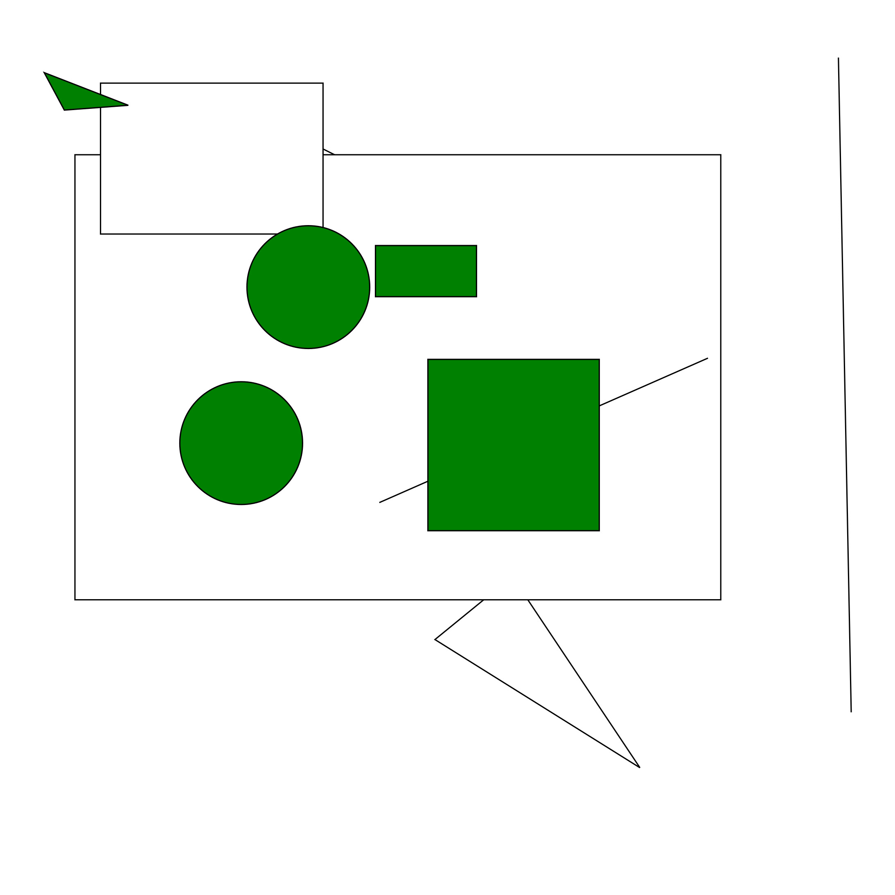
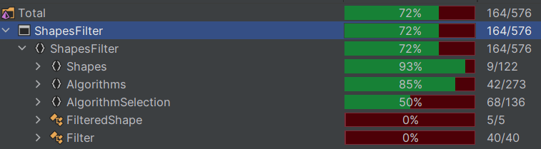

# Foreground Shapes filter

Application that can recognize foreground shapes (in physical order)  

Supported shapes:  
* Line
* Circle
* Rectangle
* Triangle

## Application structure
| Project | Description |
| ------------ | ------------------- |
| Server | Example web application that creates shapes and generating SVG image. |
| ShapesFilter | Library - providing foreground shape detector and various algorithms for shapes intersection. |
| ShapesFilterTests | Unit tests for ShapesFilter |

## Build and Run
To build the application you need **.Net 7** SDK.  
**Run commands in project folder.**  

Build application:  
```dotnet build```  

Start web application:  
```dotnet run --project ./Server/Server.csproj```  

Open *http://localhost:5263* in your browser

## Project description
### Server
Example web application to showcase foreground detection library in action.

#### Capabilities

* Create shapes with frontend interface.
* Load test case
* Generate SVG with marked foreground shapes

#### Settings
Height, width and foreground area threshold can be set in *Server/Pages/Index.cshtml.cs*

### ShapesFilter
Library that provides intersection algorithms and detecting foreground shapes

#### Capabilities

* Check intersection of various types of shapes
* Identify foreground shapes
* Build custom algorithms for shapes intersection
* Build custom foreground filter pipeline. 

#### Current algorithms
* Line to line intersection check
* Line to circle intersection check
* Line to rectangle intersection check
* Line to triangle  intersection check
* Point inside circle check
* Point inside line check
* Point inside polygon check
* Point inside triangle check
* Rectangle to rectangle check
* Circle to circle check
* Circle to polygon check
* Polygon to polygon check
* Rectangle to cicle check
* Rectangle to rectangle check


#### Code coverage


#### TODO
* Cover all classes with tests
* Improve intersection algorithms
* Filter shapes asynchronously